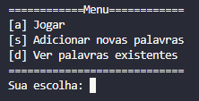
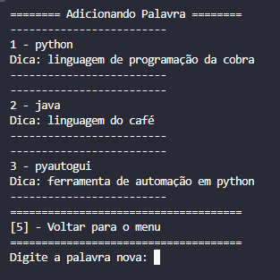
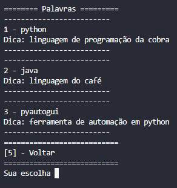
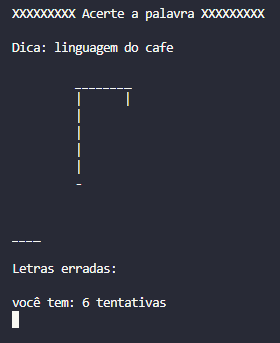
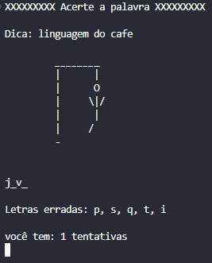
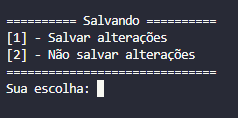

# 📚 Jogo da Forca em Python 🐍

Projeto simples de **jogo da forca** desenvolvido em Python durante o curso da **Data Science Academy**. O jogo é executado via terminal e permite ao jogador interagir com uma lista dinâmica de palavras.

---

## **⚒️ Tecnologias utilizadas**

* Python (3.12.3)
  - **random**
  - **json** 
  - **os**
* Git/GitHub

---

## 🎮 Funcionalidades

- **Jogar** tentando adivinhar uma palavra sorteada aleatoriamente.
- **Adicionar** novas palavras.
- **Remover** palavra.
- **Visualizar** todas as palavras disponíveis.
- **Salvar** as palavras localmente.
- Interface via terminal com feedback interativo.

---

## 📂 Estrutura de Pastas

```
jogo-da-forca-python/
├── imgs/
│   ├── menu_adicionando_palavra.png
│   ├── menu_jogo.png
│   ├── menu_jogo_perdendo.png
│   ├── menu_principal.png
│   └── menu_ver_palavras.png
├── arquivos/
│   └── palavra
├── .gitignore
├── jogo-da-forca.py
└── README.md
```

---

## 📸 Capturas de Tela
### 🟣 Menu inicial


### 🟣 Menu de adicionar palavras


### 🟣 Menu de ver palavras


### 🟣 Menu dentro do jogo


### 🟣 Menu dentro do jogo (perdendo)


### 🟣 Menu de salvamento 


---

## 🚀 Como Executar o Projeto:

1️⃣ **Clone o repositório:**

```bash
git clone https://github.com/brunopaz8/jogo-da-forca-python.git

```

2️⃣ **Navegue até o diretório do projeto:**

```bash
cd jogo-da-forca-python
```

3️⃣ **Execute o script no terminal:**

```bash
python jogo-da-forca.py
```

> Certifique-se de ter o [Python 3](https://www.python.org/downloads/) instalado e configurado no seu sistema.

---


