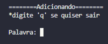
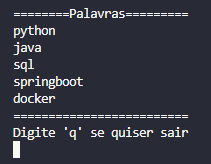
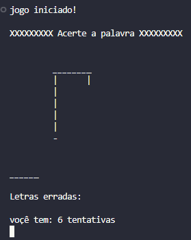

# 📚 Jogo da Forca em Python 🐍

Projeto simples de **jogo da forca** desenvolvido em Python durante o curso da **Data Science Academy**. O jogo é executado via terminal e permite ao jogador interagir com uma lista dinâmica de palavras.

## **⚒️ Tecnologias utilizadas**

* Python (3.12.3)
  - **random**
  - **os**

## 🎮 Funcionalidades

* Jogar tentando adivinhar uma palavra sorteada aleatoriamente.
* Adicionar novas palavras.
* Visualizar todas as palavras disponíveis.
* Interface via terminal com feedback interativo.

## 📸 Capturas de Tela
### 🟣 Menu inicial


### 🟣 Menu de adicionar palavras


### 🟣 Menu de ver palavras


### 🟣 Menu dentro do jogo


### 🟣 Menu dentro do jogo (perdendo)


## 🚀 Como Executar o Projeto

1️⃣ Clone o repositório:

```bash
git clone https://github.com/brunopaz8/Jogo_da_forca
cd jogo_da_forca
```

2️⃣ Execute o script no terminal:

```bash
python jogo_da_forca.py
```

> Certifique-se de ter o Python 3 instalado e configurado no seu sistema.

---

*TODO*: atualizar as imagens do readme


